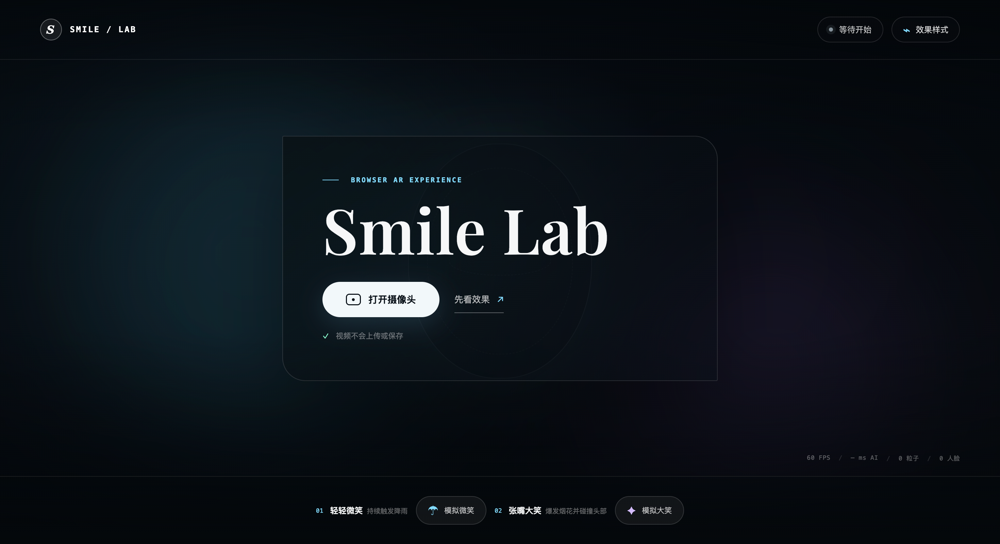
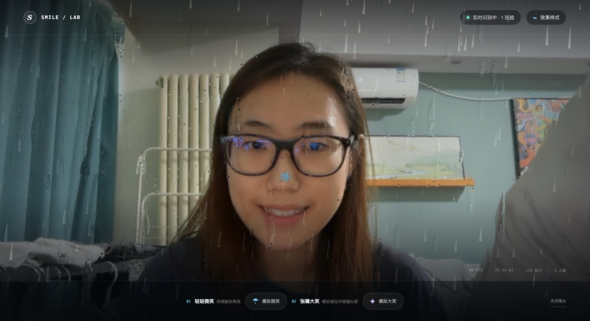
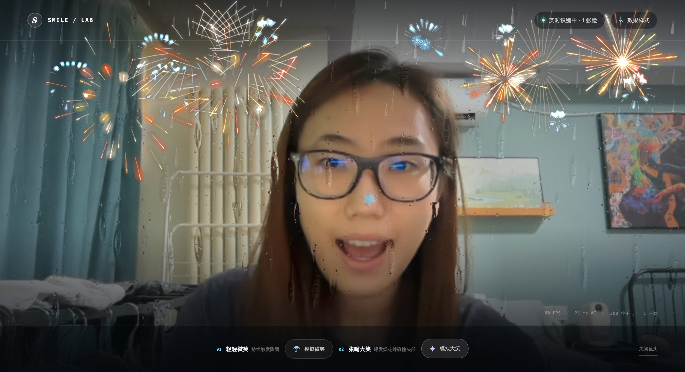
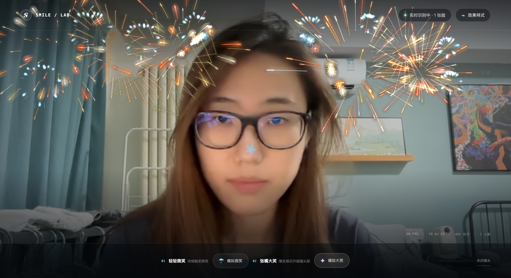
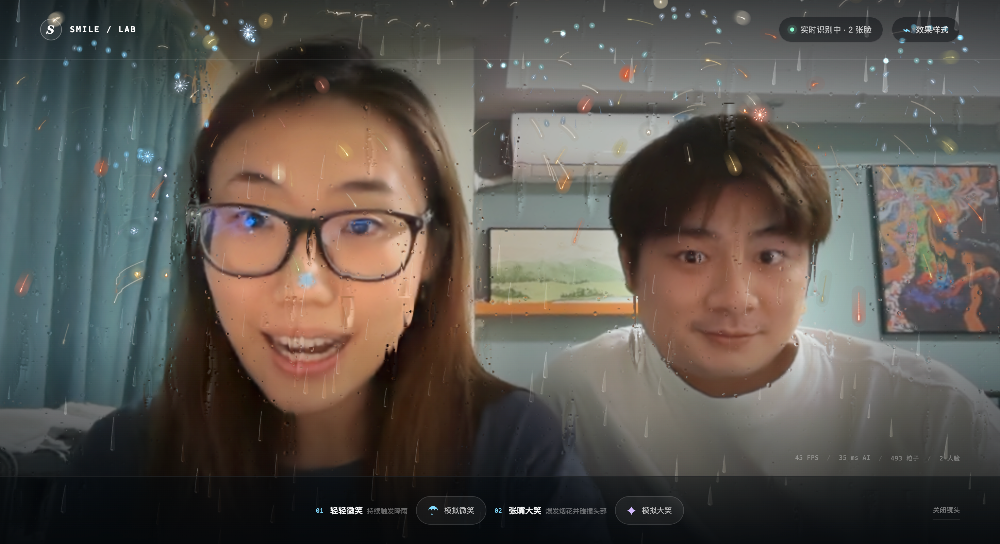

# Smile Lab

一个跑在浏览器里的实时 AR 互动实验：对着摄像头**轻轻微笑**，天空就会落下雨；**张嘴大笑**，绚烂的三重烟花为你绽放。所有人脸识别与表情判断都在本机完成，不上传、不录制、不保存任何画面。

> 🎆 立即体验：**https://w-1ren.github.io/smilelab/**

## 效果展示

### 网页封面与烟花预览

| | |
| :---: | :---: |
|  |  |

### 微笑 · 雨滴特效

微笑触发下雨：前景透明雨滴 + 玻璃挂珠与滑落水珠，雨随笑容持续、随表情收敛而渐停。



### 大笑 · 烟花特效

张嘴大笑触发完整的烟花从画面底部交错升空，绽放出三种层次的烟花。



### 烟花与头部碰撞

烟花炸开后，火花可以与画面中每个人的头部碰撞：反弹、上飞、再炸出二次闪光。



### 多人同框

支持最多 4 张脸同时入镜，每张脸都有独立的身份与表情状态，任何一人微笑都能唤醒雨，任何一人的大笑都会点燃烟花。



## 项目简介

Smile Lab 是一个完全运行在浏览器中的互动网页：摄像头画面、人脸识别、表情判断、粒子特效全部在本地实时完成。

- **微笑 → 下雨**：保持微笑持续触发降雨，透明雨滴与玻璃雨珠带来自然的暴雨氛围。
- **大笑 → 烟花**：张嘴大笑触发固定的三重烟花，一次完整交错发射 11 枚火箭——4 枚绚烂、2 枚仿真、5 枚精细。
- **碰撞互动**：烟花火花能与每个人的头部碰撞反弹，随后上飞并触发二次小闪光，让烟花“绕过”人。
- **多人同框**：最多同时识别 4 张脸，每张脸有稳定 ID、独立的微笑/大笑判定与冷却。
- **隐私优先**：不上传、不录制、不保存摄像头画面，所有计算都在你的设备上完成。
- **无摄像头也能玩**：页面上提供“模拟微笑 / 模拟大笑”按钮，随时预览完整特效链路。

## 本地运行

需要 Node.js `>= 20.9`（推荐当前 LTS 版本）：

```bash
npm ci
npm run dev
```

打开 `http://localhost:3000`，点击“打开摄像头”并允许权限即可。首次加载 MediaPipe WASM 可能需要几秒。

常用检查：

```bash
npm run typecheck   # TypeScript 静态检查
npm run lint        # ESLint
npm run build       # 生成纯静态站点到 out/
```

> 移动浏览器只允许 HTTPS 或 `localhost` 调用摄像头，建议直接使用线上体验链接，或用临时 HTTPS 隧道做本地测试。

## 技术栈

| 能力 | 方案 |
| --- | --- |
| 框架 | Next.js 16（静态导出）+ React 19 + TypeScript |
| 人脸识别 | MediaPipe FaceLandmarker（模型随仓库本地加载） |
| 雨滴特效 | Canvas 2D 粒子 + WebGL 玻璃雨珠（rain-glass-engine） |
| 烟花特效 | 自研 Canvas 2D 粒子引擎：火箭升空、三层爆炸、头部碰撞、二次闪光 |
| 表情判定 | 每脸独立状态机，带平滑、防抖与大笑冷却 |
| 部署 | GitHub Actions 自动构建部署到 GitHub Pages |

## 代码结构

```text
app/
├── SmileExperience.tsx        摄像头、推理节流、界面与手动预览
├── components/
│   └── TuningPanel.tsx        效果调参面板（雨滴 / 烟花各 3 项）
├── config/
│   └── effects.ts             所有可调参数的唯一入口
├── lib/
│   ├── face-tracker.ts        MediaPipe 多脸识别与稳定 ID
│   ├── expression.ts          每脸表情状态机
│   ├── effects-engine.ts      雨、三重烟花、碰撞、分层合成与预算
│   └── rain-glass-engine.ts   WebGL 玻璃雨珠与镜头折射
├── globals.css                全局样式
├── layout.tsx                 页面骨架与元信息
└── page.tsx                   入口
public/models/                 本地 Face Landmarker 模型
pics/                          效果展示图
tests/                         静态构建与约束测试
```

## 部署

仓库已内置 `.github/workflows/deploy-pages.yml`，push 到 `main` 分支后自动构建并部署到 GitHub Pages：

1. 在仓库 **Settings → Pages → Build and deployment** 中，Source 选择 **GitHub Actions**。
2. 每次 push 到 `main` 会自动触发 **Deploy GitHub Pages** 工作流。
3. 部署完成后访问 `https://USERNAME.github.io/REPOSITORY/`。

## 许可证

本项目代码采用 MIT License；人脸能力来自 Google MediaPipe，生产使用前请同时核对 MediaPipe 模型及上游项目许可。
